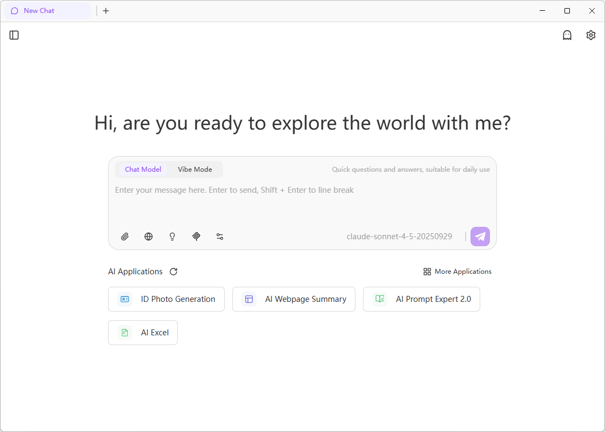
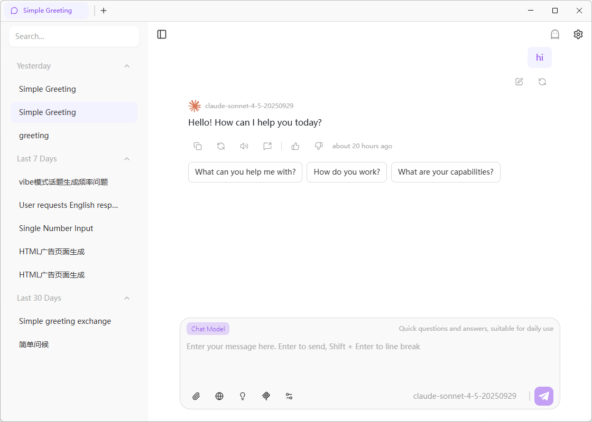
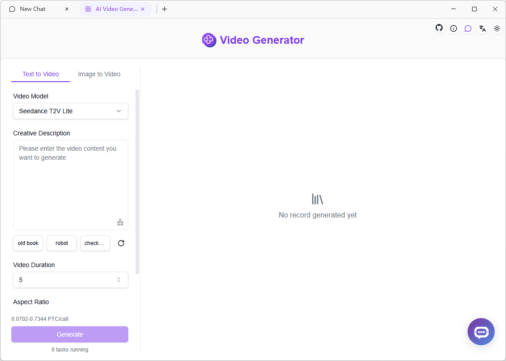
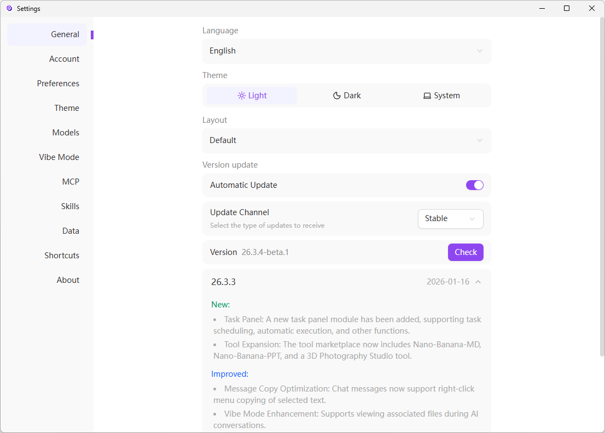
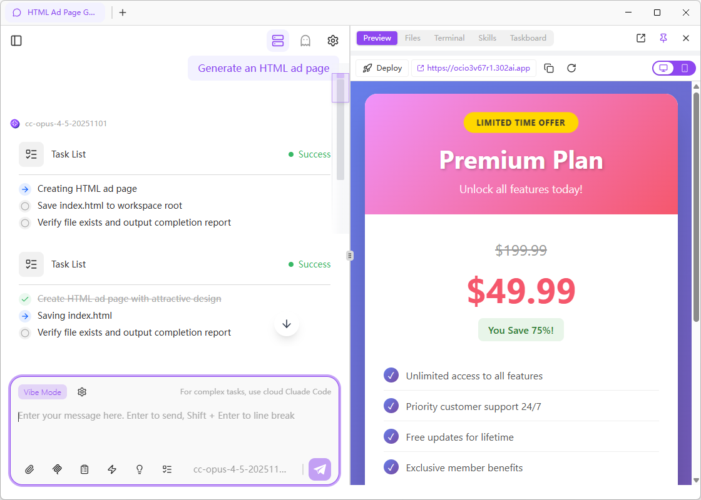

<h1 align="center">

<span>
    302 AI Studio
</span>
</h1>

<p align="center">
<em>Your cross-platform desktop AI application for Windows, Mac, and Linux. Provides powerful general AI capabilities such as code generation, document summarization, and intelligent Q&A to comprehensively boost your productivity.</em>
</p>

<p align="center"><a href="https://302.ai/" target="blank"></a></p >

<p align="center"><a href="README_zh.md">中文</a> | <a href="README.md">English</a> | <a href="README_ja.md">日本語</a></p>

<p align="center">
  <a href="https://studio.302.ai/en"> Official Website</a> •
  <a href="https://studio.302.ai/en/docs"> Documentation</a> •
  <a href="https://studio.302.ai/en/docs/getting-started"> Quick Start</a> •
  <a href="https://studio.302.ai/en/docs/changelog"> Changelog</a> •
  <a href="https://302.ai"> 302.AI Platform</a>
</p>

## 🖼️ Interface Preview

### Main Chat Interface

Clean and intuitive conversation interface, supporting multi-model switching, file uploads, tool invocation, and more


### Multi-Tab Management

Conversation list on the left, multi-tab dialogue window on the right, easily manage multiple conversation threads


### AI Application Integration

Built-in 302.AI toolbox, quickly open various AI applications with one click, no need to switch to browser


### Settings & Configuration

Independent settings window, supporting data management, Vibe mode, Skills, MCP servers, and other configurations


### Vibe Coding

Support real-time preview of AI-generated front-end code effects, WYSIWYG development experience


## 🌟 Key Features

### Multi-Model & Multi-Provider Support

- 🤖 Support for OpenAI, Anthropic, Google, and other major AI providers
- 🔄 Flexible model switching and configuration, switch between different models in the same conversation at any time
- 🎛️ Advanced conversation parameter controls (temperature, top-p, token limits, etc.)
- 📊 MCP (Model Context Protocol) server integration

### Vibe Mode (Vibe Coding)

- 🤖 Integrated Claude Code, support natural language requirement description, AI automatically completes development
- ☁️ Cloud sandbox environment, pre-installed with Node.js, Python, Git, CMake, and other development toolchains, zero configuration out of the box
- 🔒 Independently isolated cloud execution environment, AI operations do not affect local files
- 📋 Task panel displays AI execution process in real-time, achieving batch management and automatic execution of multiple AI tasks
- 🚀 One-click project deployment, instant launch, persistent hosting
- 🎭 Side-by-side preview of code execution results, supporting preview, file tree, and terminal three view modes
- 🧠 Support Plan mode, allowing AI to plan the implementation approach before execution, suitable for complex tasks and architectural design

### Claude Skills

- 📦 Support 4 creation methods: manual writing, file upload, GitHub import, history generation
- 🔧 Built-in 17 official Skills, ready to use out of the box
- 📝 Visual management interface, easily edit and organize Skills

### Document & Data Processing

- 🖼️ Upload images for AI-assisted content analysis and description generation
- 📄 Support for multiple file formats
- 💻 Code syntax highlighting
- 📊 Mermaid diagram visualization
- 📝 Full Markdown rendering support

### Excellent User Experience

- 🖥️ Multi-platform support for Windows, Mac, and Linux
- 🌙 Customizable light/dark theme system, support for custom CSS styles
- 👤 Support account login, and query balance and usage
- 📱 Responsive design, perfectly adapts to various screen sizes

### Efficient Workflow

- 🗂️ Manage multiple conversation threads simultaneously, clear thinking without confusion
- ⚡ Support for real-time streaming responses
- ⌨️ Complete keyboard shortcut system
- 🧰 Built-in 302.AI tool marketplace, covering 50+ AI application tools

### Data Management & Privacy

- 📂 Conversation records stored locally, protecting privacy
- ☁️ Support cloud synchronization, cross-device access
- 🕶️ Conversations support incognito mode, no chat records saved
- 📤 Support import and export of conversation history

### Multi-Language Support

- 🇨🇳 Chinese
- 🇺🇸 English
- 🇯🇵 Japanese (coming soon)

## 📝 Changelog

### 26.3.5 (2026-01-23)

#### ✨ New Features

- Skills Store: Added Skills Store in the client, supporting direct browsing, one-click installation, and immediate use of skills within the client
- Vibe Mode Notification Optimization: When Vibe mode is inactive, task completion will be notified via desktop notifications
- Task Board: Support for configuring task loop count, added AI intelligent decomposition feature
- Help Documentation Entry: Added "View Help Documentation" button for quick access to usage instructions
- Plan Mode: Added Plan mode (planning mode) for better task and plan management
- Web Deployment Management: Support viewing all deployed web pages and deleting deployed web pages directly from the list

#### 🔧 Improvements

- Vibe Mode Model Settings: Support configuring default model for Vibe mode
- Mode Switching Interaction Optimization: Optimized the switching interaction experience between normal chat mode and Vibe mode

#### 🐛 Bug Fixes

- Fixed the issue where editing a Skill name would incorrectly create a new Skill
- Fixed the issue where in Plan mode, after multi-selecting tasks, selection could not be canceled in some cases
- Fixed the issue where uploading txt attachments in Vibe mode could not be correctly synchronized to the sandbox environment

### 26.3.4 (2026-01-21)

#### ✨ New Features

- Vibe Mode: Added Plan mode
- Settings: Support viewing and deleting all deployed web pages
- Task Panel: Added task loop count setting

#### 🔧 Improvements

- Vibe Mode: Support setting default model to use

#### 🐛 Bug Fixes

- Fixed the issue where closing the Vibe mode settings page would mistakenly close the preview window
- Fixed the issue where starting a chat after writing on the task board would clear the task board content

### 26.3.3 (2026-01-16)

#### ✨ New Features

- Task Panel: Added task panel module, supporting task orchestration, automatic execution, and other features
- Tool Extensions: Added Nano-Banana-MD, Nano-Banana-PPT, and 3D Studio tools to the tool marketplace

#### 🔧 Improvements

- Message Copy Optimization: Chat messages support right-click menu to copy selected text content
- Vibe Mode Enhancement: Support viewing associated files during AI conversation

#### 🐛 Bug Fixes

- Fixed the display abnormality issue where conversation content overflowed the chat container boundary
- Fixed the issue where kimi-for-coding model could not be called normally in Vibe mode

### 26.3.1 (2026-01-13)

#### ✨ New Features

- Support displaying changelog

### 26.2.2 (2026-01-09)

#### ✨ New Features

- Claude Skills System: Brand new visual management panel
- Support 4 Skill creation methods (manual/upload/GitHub/history)
- Built-in 17 official Skills, ready to use out of the box

---

## 🛠️ Technical Architecture

### 🏗️ Core Technology Stack

| Layer                    | Technology                              | Description                                                          |
| ------------------------ | --------------------------------------- | -------------------------------------------------------------------- |
| **UI Layer**             | SvelteKit 5 + TypeScript                | Modern component development, type safety, reactive state management |
| **Style Layer**          | TailwindCSS 4.x + Custom Theme System   | Atomic CSS + smooth animations                                       |
| **Desktop**              | Electron 38                             | Cross-platform desktop application framework                         |
| **State Management**     | Svelte 5 Runes                          | Reactive state management (`$state`, `$derived`)                     |
| **UI Component Library** | Shadcn-Svelte (bits-ui)                 | Modern, accessible component library                                 |
| **Internationalization** | Inlang Paraglide-js                     | Multi-language support                                               |
| **AI Integration**       | AI SDK                                  | Unified AI provider interface                                        |
| **Build Tools**          | Vite + Electron Forge                   | Fast build + hot reload                                              |
| **Type System**          | TypeScript                              | Strict type checking                                                 |
| **Code Quality**         | ESLint + Prettier + Vitest + Playwright | Code standards + unit tests + E2E tests                              |

## 🚀 Quick Start

### 📋 System Requirements

- **Operating System**: Windows 10+ / macOS 10.14+ / Linux (Ubuntu 18.04+)
- **Node.js**: 18.x or higher
- **Package Manager**: pnpm 10.18.3+ (required)
- **Memory**: 4GB RAM (8GB+ recommended)
- **Storage**: 500MB available space
- **Network**: Stable internet connection (to access AI provider APIs)

### ⚡ Installation & Launch

```bash
# 1️⃣ Clone the project
git clone https://github.com/302ai/302-AI-Studio.git
cd 302-AI-Studio

# 2️⃣ Install dependencies
pnpm install

# 3️⃣ Start the development server 🎉
pnpm dev
```

> [!WARNING]
> This project must use `pnpm` as the package manager. The project includes necessary patches for SvelteKit, and other package managers may not work properly.

## 📦 Build & Deployment

### 🔧 Development Commands

```bash
# Start development server (with hot reload)
pnpm dev

# Type checking
pnpm check

# Code linting
pnpm lint

# Auto-fix linting issues
pnpm lint:fix

# Format code
pnpm format

# Check code formatting
pnpm format:check

# Complete quality check
pnpm quality

# Auto-fix all issues
pnpm quality:fix
```

### 🧪 Testing

```bash
# Run unit tests
pnpm test:unit

# Run E2E tests
pnpm test:e2e

# Run all tests
pnpm test
```

### 🚀 Production Build

```bash
# Build SvelteKit application
pnpm build

# Package Electron app (output in /out directory)
pnpm package

# Create distributable installer
pnpm make

# Publish to configured targets
pnpm publish
```

### 📱 Cross-Platform Support

| Platform | Architecture        | Status             |
| -------- | ------------------- | ------------------ |
| Windows  | x64 / ARM64         | ✅ Fully Supported |
| macOS    | x64 / Apple Silicon | ✅ Fully Supported |
| Linux    | x64 / ARM64         | ✅ Fully Supported |

## 🛠️ Development Guide

### 📁 Project Structure

```
📦 302-AI-Studio-sv
├── 📂 src/                          # Renderer process source code
│   ├── 📂 lib/                       # Shared libraries
│   │   ├── 📂 components/            # UI components
│   │   │   ├── ui/                   # Shadcn-Svelte base components (40+)
│   │   │   └── buss/                 # Business components
│   │   │       ├── chat/             # Chat interface
│   │   │       ├── model-*/          # Model selection and configuration
│   │   │       ├── provider-*/       # AI provider management
│   │   │       ├── theme-*/          # Theme system
│   │   │       └── settings/         # Application settings
│   │   ├── 📂 stores/                # State management (Svelte 5 Runes)
│   │   ├── 📂 types/                 # TypeScript type definitions
│   │   ├── 📂 api/                   # API integration layer
│   │   ├── 📂 utils/                 # Utility functions
│   │   ├── 📂 theme/                 # Theme system
│   │   ├── 📂 datas/                 # Static data
│   │   └── 📂 hooks/                 # Svelte Hooks
│   ├── 📂 routes/                    # Routes
│   │   ├── (with-sidebar)/           # Main application layout
│   │   │   └── chat/                 # Chat interface routes
│   │   ├── (settings-page)/          # Settings page layout
│   │   │   └── settings/             # Settings route groups
│   │   └── shell/                     # Shell window routes
│   ├── 📂 shared/                    # Cross-process shared code
│   │   ├── storage/                  # Persistent storage
│   │   └── types/                    # Shared types
│   ├── 📂 messages/                  # Internationalization message files
│   └── 📄 app.html                   # HTML template
├── 📂 electron/                      # Electron main process
│   ├── main/                         # Main process code
│   │   ├── services/                 # IPC services
│   │   ├── generated/                # Auto-generated IPC bindings
│   │   └── constants/                # Electron constants
│   └── preload/                      # Preload scripts
├── 📂 vite-plugins/                  # Custom Vite plugins
│   └── ipc-service-generator/        # IPC service generator
├── 📂 scripts/                       # Build scripts
├── 📂 docs/                          # Documentation
├── 📂 e2e/                           # Playwright E2E tests
└── 📄 package.json                   # Project configuration
```

## 🤝 Contribution Guide

We welcome all forms of contributions! Whether it's reporting bugs, suggesting new features, or submitting code improvements.

### 💡 Ways to Contribute

1. **Code Contributions**: Submit PRs to improve the code
2. **Bug Fixes**: Submit fixes for issues you've discovered
3. **Feature Suggestions**: Have a great idea? We'd love to hear your suggestions
4. **Documentation**: Help us improve documentation and usage guides
5. **Promotion**: Spread the word about 302 AI Studio

### 📋 Contribution Steps

```bash
# 1. Fork the project
# 2. Create a feature branch
git checkout -b feature/amazing-feature

# 3. Commit changes (following Conventional Commits)
git commit -m 'feat: add amazing feature'

# 4. Push to the branch
git push origin feature/amazing-feature

# 5. Create a Pull Request
```

## 🔗 Related Links

<div align="center">

### Official Website

[](https://302.ai)
[](https://studio.302.ai/en)
[](https://studio.302.ai/en/docs)
[](https://doc.302.ai)
[](https://help.302.ai)

</div>

## 💬 Contact Us

<div align="center">

[](mailto:support@302.ai)

**Encountering issues?** Please provide feedback in [GitHub Issues](https://github.com/302ai/302-AI-Studio-sv/issues)

**Quick Start?** Check out the [Quick Start Guide](https://studio.302.ai/en/docs/getting-started)

</div>

## 📄 License

This project is open source under [AGPL-3.0](LICENSE), you are free to use, modify, and distribute it.

## ✨ About 302.AI

[302.AI](https://302.ai) is a pay-as-you-go AI application platform that solves the last-mile problem of applying AI in practice.

1. 🧠 Comprehensive collection of the latest and most complete AI capabilities and brands, including but not limited to language models, image models, audio models, and video models
2. 🚀 Deep application development based on foundation models, developing real AI products rather than simple chatbots
3. 💰 Zero monthly fees, all features are pay-as-you-go, fully open, truly low barriers with high ceilings
4. 🛠️ Powerful management backend, targeting teams and small-to-medium enterprises, one person manages, multiple people use
5. 🔗 All AI capabilities provide API access, all tools are open source and customizable (in progress)
6. 💡 Strong development team, launching 2-3 new applications weekly, with daily product updates. Developers interested in joining are welcome to contact us
