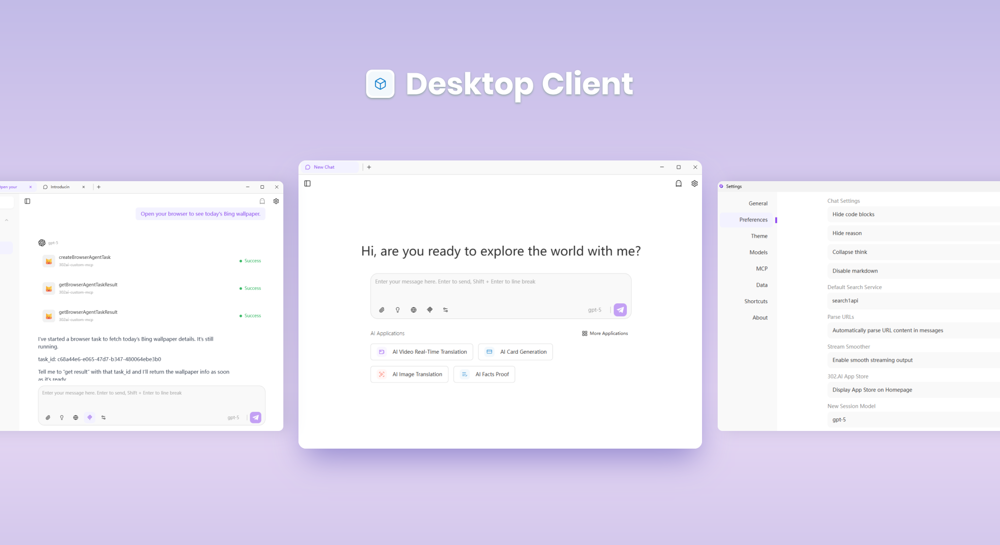
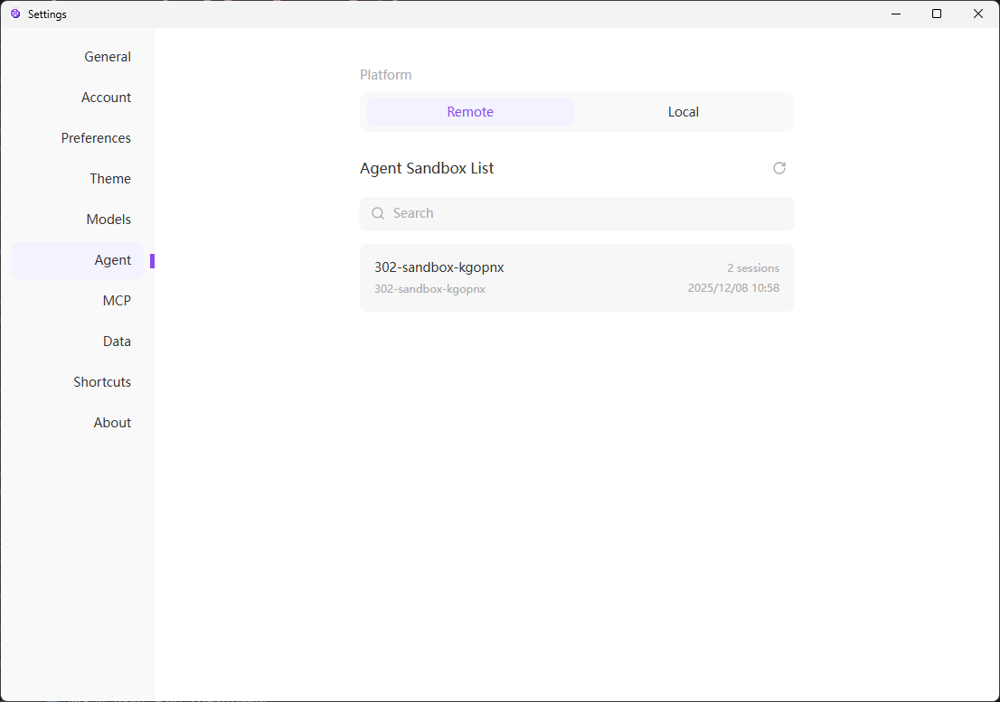

<h1 align="center">

<span>
    302 AI Studio
</span>
</h1>

<p align="center">
<em>302 AI Studio is a desktop client supporting multiple LLM service providers, compatible with Windows, Mac, and Linux.</em>
</p>

<p align="center"><a href="https://302.ai/" target="blank"></a></p >

<p align="center"><a href="README_zh.md">中文</a> | <a href="README.md">English</a> | <a href="README_ja.md">日本語</a></p>



## 🖼️ Interface Screenshots

Home chat interface, providing input box, toolbar, model selection, and quick access to commonly used AI tools  


Multi-tab chat interface with conversation list on the left and chat window on the right


Quickly open AI applications within the client, no need to visit websites


Settings page in standalone window, including General, Account, Preferences, MCP, and other common configurations


Agent management page, supports switching between remote/local platforms and viewing/managing the list of agent sandboxes


## 🌟 Key Features

### Multi-Model & Multi-Provider Support

- 🤖 Support for OpenAI, Anthropic, Google, and other major AI providers
- 🔄 Flexible model switching and configuration
- 🎛️ Advanced conversation parameter controls (temperature, top-p, token limits, etc.)
- 📊 MCP (Model Context Protocol) server integration

### Document & Data Processing

- 🖼️ Upload images for AI-assisted content analysis and description generation
- 📄 Support for multiple file formats
- 💻 Code syntax highlighting
- 📊 Mermaid diagram visualization
- 📝 Full Markdown rendering support

### Excellent User Experience

- 🖥️ Multi-platform support for Windows, Mac, and Linux
- 🌙 Customizable light/dark theme system with real-time preview
- 👤 Support account login, and allows checking balance and usage
- 📝 Complete Markdown rendering
- 📱 Responsive design, perfectly adapts to various screen sizes
- 🎨 Modern component library based on Shadcn-Svelte

### Efficient Workflow

- 🗂️ Manage multiple conversation threads simultaneously, organized and clear
- ⚡ Support for real-time streaming responses
- ⌨️ Complete keyboard shortcut system
- 🔄 Hot Module Replacement (HMR) support for smooth development experience

### Agent Mode

- 🤖 Invoke Claude Code via remote sandbox environments for intelligent task planning
- 🎯 Agent task execution and real-time monitoring, track task progress and status
- 🔄 Intelligent workflow management, supporting complex task decomposition and collaboration
- 📊 Agent session statistics and analysis, view execution history and performance data
- 🚀 One-click full-stack application deployment, Agent automatically writes, tests, and deploys code
- 📦 Support for multiple tech stacks, quickly build web applications, API services, and more

### Multi-Language Support

- **中文**
- **English**
- **日本語**(coming soon)

## 📝 Changelog

**[v25.50.8]** Added Agent mode; added quick login and account configuration

> 💡 For the complete update history, please visit [GitHub Releases](https://github.com/302ai/302-AI-Studio-sv/releases)

---

## 🛠️ Technical Architecture

### 🏗️ Core Technology Stack

| Layer                    | Technology                              | Description                                                          |
| ------------------------ | --------------------------------------- | -------------------------------------------------------------------- |
| **UI Layer**             | SvelteKit 5 + TypeScript                | Modern component development, type safety, reactive state management |
| **Style Layer**          | TailwindCSS 4.x + Custom Theme System   | Atomic CSS + smooth animations                                       |
| **Desktop**              | Electron 38                             | Cross-platform desktop application framework                         |
| **State Management**     | Svelte 5 Runes                          | Reactive state management (`$state`, `$derived`)                     |
| **UI Component Library** | Shadcn-Svelte (bits-ui)                 | Modern, accessible component library                                 |
| **Internationalization** | Inlang Paraglide-js                     | Multi-language support                                               |
| **AI Integration**       | AI SDK                                  | Unified AI provider interface                                        |
| **Build Tools**          | Vite + Electron Forge                   | Fast build + hot reload                                              |
| **Type System**          | TypeScript                              | Strict type checking                                                 |
| **Code Quality**         | ESLint + Prettier + Vitest + Playwright | Code standards + unit tests + E2E tests                              |

## 🚀 Quick Start

### 📋 System Requirements

- **Operating System**: Windows 10+ / macOS 10.14+ / Linux (Ubuntu 18.04+)
- **Node.js**: 18.x or higher
- **Package Manager**: pnpm 10.18.3+ (required)
- **Memory**: 4GB RAM (8GB+ recommended)
- **Storage**: 500MB available space
- **Network**: Stable internet connection (to access AI provider APIs)

### ⚡ Installation & Launch

```bash
# 1️⃣ Clone the project
git clone https://github.com/302ai/302-AI-Studio-sv.git
cd 302-AI-Studio-sv

# 2️⃣ Install dependencies
pnpm install

# 3️⃣ Start the development server 🎉
pnpm dev
```

> [!WARNING]
> This project must use `pnpm` as the package manager. The project includes necessary patches for SvelteKit, and other package managers may not work properly.

## 📦 Build & Deployment

### 🔧 Development Commands

```bash
# Start development server (with hot reload)
pnpm dev

# Type checking
pnpm check

# Code linting
pnpm lint

# Auto-fix linting issues
pnpm lint:fix

# Format code
pnpm format

# Check code formatting
pnpm format:check

# Complete quality check
pnpm quality

# Auto-fix all issues
pnpm quality:fix
```

### 🧪 Testing

```bash
# Run unit tests
pnpm test:unit

# Run E2E tests
pnpm test:e2e

# Run all tests
pnpm test
```

### 🚀 Production Build

```bash
# Build SvelteKit application
pnpm build

# Package Electron app (output in /out directory)
pnpm package

# Create distributable installer
pnpm make

# Publish to configured targets
pnpm publish
```

### 📱 Cross-Platform Support

| Platform | Architecture        | Status             |
| -------- | ------------------- | ------------------ |
| Windows  | x64 / ARM64         | ✅ Fully Supported |
| macOS    | x64 / Apple Silicon | ✅ Fully Supported |
| Linux    | x64 / ARM64         | ✅ Fully Supported |

## 🛠️ Development Guide

### 📁 Project Structure

```
📦 302-AI-Studio-sv
├── 📂 src/                          # Renderer process source code
│   ├── 📂 lib/                       # Shared libraries
│   │   ├── 📂 components/            # UI components
│   │   │   ├── ui/                   # Shadcn-Svelte base components (40+)
│   │   │   └── buss/                 # Business components
│   │   │       ├── chat/             # Chat interface
│   │   │       ├── model-*/          # Model selection and configuration
│   │   │       ├── provider-*/       # AI provider management
│   │   │       ├── theme-*/          # Theme system
│   │   │       └── settings/         # Application settings
│   │   ├── 📂 stores/                # State management (Svelte 5 Runes)
│   │   ├── 📂 types/                 # TypeScript type definitions
│   │   ├── 📂 api/                   # API integration layer
│   │   ├── 📂 utils/                 # Utility functions
│   │   ├── 📂 theme/                 # Theme system
│   │   ├── 📂 datas/                 # Static data
│   │   └── 📂 hooks/                 # Svelte Hooks
│   ├── 📂 routes/                    # Routes
│   │   ├── (with-sidebar)/           # Main application layout
│   │   │   └── chat/                 # Chat interface routes
│   │   ├── (settings-page)/          # Settings page layout
│   │   │   └── settings/             # Settings route groups
│   │   └── shell/                     # Shell window routes
│   ├── 📂 shared/                    # Cross-process shared code
│   │   ├── storage/                  # Persistent storage
│   │   └── types/                    # Shared types
│   ├── 📂 messages/                  # Internationalization message files
│   └── 📄 app.html                   # HTML template
├── 📂 electron/                      # Electron main process
│   ├── main/                         # Main process code
│   │   ├── services/                 # IPC services
│   │   ├── generated/                # Auto-generated IPC bindings
│   │   └── constants/                # Electron constants
│   └── preload/                      # Preload scripts
├── 📂 vite-plugins/                  # Custom Vite plugins
│   └── ipc-service-generator/        # IPC service generator
├── 📂 scripts/                       # Build scripts
├── 📂 docs/                          # Documentation
├── 📂 e2e/                           # Playwright E2E tests
└── 📄 package.json                   # Project configuration
```

## 🤝 Contribution Guide

We welcome all forms of contributions! Whether it's reporting bugs, suggesting new features, or submitting code improvements.

### 💡 Ways to Contribute

1. **Code Contributions**: Submit PRs to improve the code
2. **Bug Fixes**: Submit fixes for issues you've discovered
3. **Feature Suggestions**: Have a great idea? We'd love to hear your suggestions
4. **Documentation**: Help us improve documentation and usage guides
5. **Promotion**: Spread the word about 302 AI Studio

### 📋 Contribution Steps

```bash
# 1. Fork the project
# 2. Create a feature branch
git checkout -b feature/amazing-feature

# 3. Commit changes (following Conventional Commits)
git commit -m 'feat: add amazing feature'

# 4. Push to the branch
git push origin feature/amazing-feature

# 5. Create a Pull Request
```

## 💬 Contact Us

<div align="center">

[](https://302.ai)
[](https://github.com/302ai/302-AI-Studio-sv)
[](mailto:support@302.ai)

**Encountering issues?** Please provide feedback in [GitHub Issues](https://github.com/302ai/302-AI-Studio-sv/issues)

**Have feature suggestions?** We're waiting for you in [GitHub Discussions](https://github.com/302ai/302-AI-Studio-sv/discussions)

</div>

## 📄 License

This project is open source under [AGPL-3.0](LICENSE), you are free to use, modify, and distribute it.

## ✨ About 302.AI

[302.AI](https://302.ai) is a pay-as-you-go AI application platform that solves the last-mile problem of applying AI in practice.

1. 🧠 Comprehensive collection of the latest and most complete AI capabilities and brands, including but not limited to language models, image models, audio models, and video models
2. 🚀 Deep application development based on foundation models, developing real AI products rather than simple chatbots
3. 💰 Zero monthly fees, all features are pay-as-you-go, fully open, truly low barriers with high ceilings
4. 🛠️ Powerful management backend, targeting teams and small-to-medium enterprises, one person manages, multiple people use
5. 🔗 All AI capabilities provide API access, all tools are open source and customizable (in progress)
6. 💡 Strong development team, launching 2-3 new applications weekly, with daily product updates. Developers interested in joining are welcome to contact us
