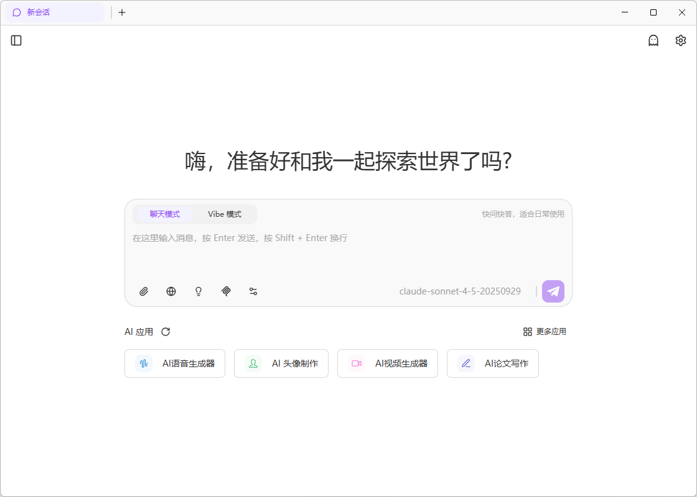
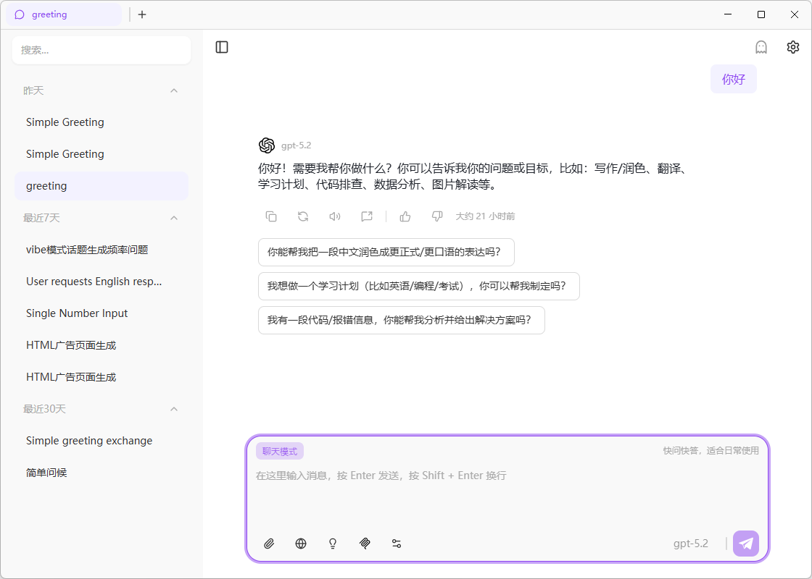
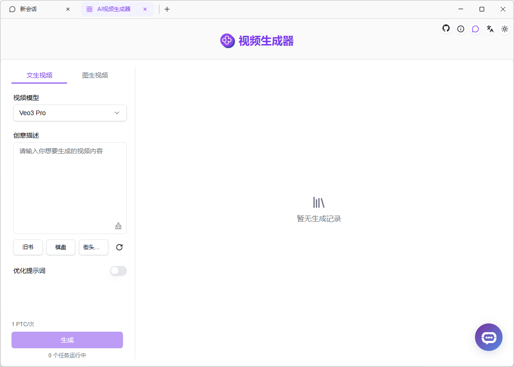
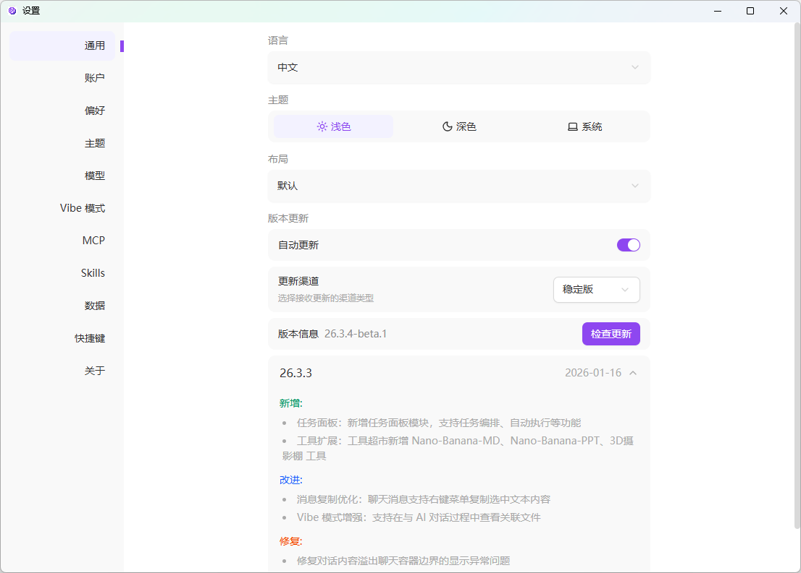
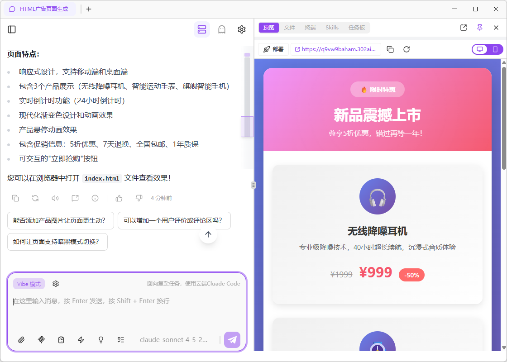

<h1 align="center">

<span>
    302 AI Studio
</span>
</h1>

<p align="center">
<em>您的跨平台桌面 AI 应用，适用于 Windows、Mac 和 Linux。提供强大的通用 AI 能力，如代码生成、文档总结和智能问答，全面提升您的生产力。</em>
</p>

<p align="center"><a href="https://302.ai/" target="blank"></a></p >

<p align="center"><a href="README_zh.md">中文</a> | <a href="README.md">English</a> | <a href="README_ja.md">日本語</a></p>

<p align="center">
  <a href="https://studio.302.ai/zh"> 客户端官网</a> •
  <a href="https://studio.302.ai/zh/docs"> 官方文档</a> •
  <a href="https://studio.302.ai/zh/docs/getting-started"> 快速开始</a> •
  <a href="https://studio.302.ai/zh/docs/changelog"> 更新日志</a> •
  <a href="https://302.ai"> 302.AI 平台</a>
</p>

## 🖼️ 界面预览

### 主聊天界面

简洁直观的对话界面，支持多模型切换、文件上传、工具调用等功能


### 多标签管理

左侧会话列表，右侧多标签对话窗口，轻松管理多个对话线程


### AI 应用集成

内置 302.AI 工具箱，一键快速打开各类 AI 应用，无需跳转浏览器


### 设置与配置

独立设置窗口，支持数据管理、Vibe 模式、Skills、MCP 服务器等配置


### Vibe Coding

支持实时预览 AI 生成的前端代码效果，所见即所得的开发体验


## 🌟 主要特点

### 多模型与多服务商支持

- 🤖 支持 OpenAI、Anthropic、Google 等多主流 AI 提供商
- 🔄 灵活的模型切换与配置，同一对话可随时切换不同模型
- 🎛️ 高级对话参数控制（温度、top-p、token 限制等）
- 📊 MCP（Model Context Protocol）服务器集成

### Vibe 模式（Vibe Coding）

- 🤖 集成 Claude Code，支持自然语言描述需求，AI 自动完成开发
- ☁️ 云端沙盒环境，预装 Node.js、Python、Git、CMake 等开发工具链，零配置开箱即用
- 🔒 独立隔离的云端执行环境，AI 操作不影响本地文件
- 📋 任务面板实时显示 AI 执行过程，实现批量管理和自动执行多个 AI 任务
- 🚀 一键部署项目，即时上线，持久托管
- 🎭 同屏预览代码运行结果，支持预览、文件树、终端三种视图模式
- 🧠 支持 Plan 模式，让 AI 先规划实施方案再执行，适合复杂任务和架构设计

### Claude Skills

- 📦 支持 4 种创建方式：手动编写、文件上传、GitHub 导入、历史记录生成
- 🔧 内置 17 个官方 Skills，开箱即用
- 📝 可视化管理界面，轻松编辑和组织 Skills

### 文档与数据处理

- 🖼️ 上传图片让 AI 帮你分析内容、生成描述
- 📄 支持多种文件格式处理
- 💻 代码高亮显示
- 📊 Mermaid 图表可视化
- 📝 完整的 Markdown 渲染支持

### 优质使用体验

- 🖥️ Windows、Mac、Linux 多平台支持
- 🌙 可自定义的明暗主题系统，支持自定义CSS样式
- 👤 支持账户登录，并可查询余额与使用情况
- 📱 响应式设计，完美适配各种屏幕尺寸

### 高效工作流

- 🗂️ 同时进行多个对话线程，思路清晰不混乱
- ⚡ 支持实时流式响应
- ⌨️ 完整的快捷键系统
- 🧰 内置 302.AI 工具超市，涵盖 50+ 款 AI 应用工具

### 数据管理与隐私

- 📂 对话记录本地存储，保护隐私
- ☁️ 支持云端同步，跨设备访问
- 🕶️ 对话支持无痕模式，不保存任何聊天记录
- 📤 支持导入导出对话历史

### 多语言支持

- 🇨🇳 中文
- 🇺🇸 English
- 🇯🇵 日本語（后续支持）

## 📝 更新日志

### 26.3.5 (2026-01-23)

#### ✨ 新增

- Skills 商店：客户端新增 Skills 商店,支持在客户端内直接浏览、一键安装技能并立即使用
- Vibe 模式通知优化：当 Vibe 模式处于非活跃状态时，任务完成将通过桌面通知提醒
- 任务看板：支持配置任务循环次数，新增 AI 智能拆解功能
- 帮助文档入口：新增"查看帮助文档"按钮，便于快速查阅使用说明
- Plan 模式：新增 Plan 模式（规划模式），用于更好地进行任务与计划管理
- 网页部署管理：支持查看所有已部署的网页，并支持在列表中直接删除已部署的网页

#### 🔧 改进

- Vibe 模式模型设置：支持为 Vibe 模式配置默认使用的模型
- 模式切换交互优化：优化普通聊天模式与 Vibe 模式之间的切换交互体验

#### 🐛 修复

- 修复编辑 Skill 名称时会错误地创建出一个新 Skill 的问题
- 修复 Plan 模式下多选任务后，部分情况下无法取消选择的问题
- 修复 Vibe 模式中上传 txt 附件无法正确同步到沙盒环境的问题

### 26.3.4 (2026-01-21)

#### ✨ 新增

- Vibe 模式：新增 Plan 模式
- 设置：支持查看和删除所有已部署的网页
- 任务面板：新增任务循环次数设置

#### 🔧 改进

- Vibe 模式：支持设置默认使用的模型

#### 🐛 修复

- 修复 Vibe 模式设置页面关闭时误关闭预览窗口的问题
- 修复编写任务板后开始聊天导致任务板内容被清空的问题

### 26.3.3 (2026-01-16)

#### ✨ 新增

- 任务面板：新增任务面板模块，支持任务编排、自动执行等功能
- 工具扩展：工具超市新增 Nano-Banana-MD、Nano-Banana-PPT、3D摄影棚 工具

#### 🔧 改进

- 消息复制优化：聊天消息支持右键菜单复制选中文本内容
- Vibe 模式增强：支持在与 AI 对话过程中查看关联文件

#### 🐛 修复

- 修复对话内容溢出聊天容器边界的显示异常问题
- 修复 kimi-for-coding 模型在 Vibe 模式下无法正常调用的问题

### 26.3.1 (2026-01-13)

#### ✨ 新增

- 支持显示更新日志

### 26.2.2 (2026-01-09)

#### ✨ 新增

- Claude Skills 系统：全新可视化管理面板
- 支持 4 种 Skill 创建方式（手动/上传/GitHub/历史记录）
- 内置 17 个官方 Skills，开箱即用

---

## 🛠️ 技术架构

### 🏗️ 核心技术栈

| 层级          | 技术选型                                | 说明                                   |
| ------------- | --------------------------------------- | -------------------------------------- |
| **界面层**    | SvelteKit 5 + TypeScript                | 现代组件开发，类型安全，响应式状态管理 |
| **样式层**    | TailwindCSS 4.x + 自定义主题系统        | 原子化 CSS + 流畅动画                  |
| **桌面端**    | Electron 38                             | 跨平台桌面应用框架                     |
| **状态管理**  | Svelte 5 Runes                          | 响应式状态管理（`$state`, `$derived`） |
| **UI 组件库** | Shadcn-Svelte (bits-ui)                 | 现代化、可访问的组件库                 |
| **国际化**    | Inlang Paraglide-js                     | 多语言支持                             |
| **AI 集成**   | AI SDK                                  | 统一的 AI 提供商接口                   |
| **构建工具**  | Vite + Electron Forge                   | 快速构建 + 热重载                      |
| **类型系统**  | TypeScript                              | 严格的类型检查                         |
| **代码质量**  | ESLint + Prettier + Vitest + Playwright | 代码规范 + 单元测试 + E2E 测试         |

## 🚀 快速开始

### 📋 系统要求

- **操作系统**: Windows 10+ / macOS 10.14+ / Linux (Ubuntu 18.04+)
- **Node.js**: 18.x 或更高版本
- **包管理器**: pnpm 10.18.3+（必需）
- **内存**: 4GB RAM（推荐 8GB+）
- **存储**: 500MB 可用空间
- **网络**: 稳定的互联网连接（访问 AI 服务商 API）

### ⚡ 安装与启动

```bash
# 1️⃣ 克隆项目
git clone https://github.com/302ai/302-AI-Studio.git
cd 302-AI-Studio

# 2️⃣ 安装依赖
pnpm install

# 3️⃣ 启动开发服务器 🎉
pnpm dev
```

> [!WARNING]
> 此项目必须使用 `pnpm` 作为包管理器。项目包含对 SvelteKit 的必要补丁，其他包管理器可能无法正常工作。

## 📦 构建与部署

### 🔧 开发命令

```bash
# 启动开发服务器（支持热重载）
pnpm dev

# 类型检查
pnpm check

# 代码规范检查
pnpm lint

# 自动修复代码问题
pnpm lint:fix

# 格式化代码
pnpm format

# 检查代码格式
pnpm format:check

# 完整质量检查
pnpm quality

# 自动修复所有问题
pnpm quality:fix
```

### 🧪 测试

```bash
# 运行单元测试
pnpm test:unit

# 运行 E2E 测试
pnpm test:e2e

# 运行所有测试
pnpm test
```

### 🚀 生产构建

```bash
# 构建 SvelteKit 应用
pnpm build

# 打包 Electron 应用（输出在 /out 目录）
pnpm package

# 创建可分发安装包
pnpm make

# 发布到配置的目标
pnpm publish
```

### 📱 跨平台支持

| 平台    | 架构                | 状态        |
| ------- | ------------------- | ----------- |
| Windows | x64 / ARM64         | ✅ 完全支持 |
| macOS   | x64 / Apple Silicon | ✅ 完全支持 |
| Linux   | x64 / ARM64         | ✅ 完全支持 |

## 🛠️ 开发指南

### 📁 项目结构

```
📦 302-AI-Studio-sv
├── 📂 src/                          # 渲染进程源代码
│   ├── 📂 lib/                       # 共享库
│   │   ├── 📂 components/            # UI 组件
│   │   │   ├── ui/                   # Shadcn-Svelte 基础组件（40+）
│   │   │   └── buss/                 # 业务组件
│   │   │       ├── chat/             # 聊天界面
│   │   │       ├── model-*/          # 模型选择与配置
│   │   │       ├── provider-*/       # AI 提供商管理
│   │   │       ├── theme-*/          # 主题系统
│   │   │       └── settings/         # 应用设置
│   │   ├── 📂 stores/                # 状态管理（Svelte 5 Runes）
│   │   ├── 📂 types/                 # TypeScript 类型定义
│   │   ├── 📂 api/                   # API 集成层
│   │   ├── 📂 utils/                 # 工具函数
│   │   ├── 📂 theme/                 # 主题系统
│   │   ├── 📂 datas/                 # 静态数据
│   │   └── 📂 hooks/                 # Svelte Hooks
│   ├── 📂 routes/                    # 路由
│   │   ├── (with-sidebar)/           # 主应用布局
│   │   │   └── chat/                 # 聊天界面路由
│   │   ├── (settings-page)/          # 设置页面布局
│   │   │   └── settings/             # 设置路由组
│   │   └── shell/                     # Shell 窗口路由
│   ├── 📂 shared/                    # 跨进程共享代码
│   │   ├── storage/                  # 持久化存储
│   │   └── types/                    # 共享类型
│   ├── 📂 messages/                  # 国际化消息文件
│   └── 📄 app.html                   # HTML 模板
├── 📂 electron/                      # Electron 主进程
│   ├── main/                         # 主进程代码
│   │   ├── services/                 # IPC 服务
│   │   ├── generated/                # 自动生成的 IPC 绑定
│   │   └── constants/                # Electron 常量
│   └── preload/                      # Preload 脚本
├── 📂 vite-plugins/                  # 自定义 Vite 插件
│   └── ipc-service-generator/        # IPC 服务生成器
├── 📂 scripts/                       # 构建脚本
├── 📂 docs/                          # 文档
├── 📂 e2e/                           # Playwright E2E 测试
└── 📄 package.json                   # 项目配置
```

## 🤝 贡献指南

我们欢迎所有形式的贡献！无论是报告 bug、提出新功能建议，还是提交代码改进。

### 💡 贡献方式

1. **代码贡献**：提交 PR 来改进代码
2. **修复 Bug**：提交你发现的问题修复
3. **功能建议**：有好想法？我们很乐意听取你的建议
4. **编写文档**：帮助我们完善文档和使用指南
5. **推广应用**：宣传 302 AI Studio

### 📋 贡献步骤

```bash
# 1. Fork 项目
# 2. 创建功能分支
git checkout -b feature/amazing-feature

# 3. 提交更改（遵循 Conventional Commits）
git commit -m 'feat: add amazing feature'

# 4. 推送到分支
git push origin feature/amazing-feature

# 5. 创建 Pull Request
```

## 🔗 相关链接

<div align="center">

### 官方网站

[](https://302.ai)
[](https://studio.302.ai/zh)
[](https://studio.302.ai/zh/docs)
[](https://doc.302.ai)
[](https://help.302.ai)

</div>

## 💬 联系我们

<div align="center">

[](mailto:support@302.ai)

**遇到问题？** 请在 [GitHub Issues](https://github.com/302ai/302-AI-Studio-sv/issues) 中反馈

**快速开始？** 查看 [快速开始指南](https://studio.302.ai/zh/docs/getting-started)

</div>

## 📄 许可证

本项目基于 [AGPL-3.0](LICENSE) 开源，你可以自由使用、修改和分发。

## ✨ 302.AI 介绍

[302.AI](https://302.ai) 是一个按需付费的 AI 应用平台，为用户解决 AI 用于实践的最后一公里问题。

1. 🧠 集合了最新最全的 AI 能力和品牌，包括但不限于语言模型、图像模型、声音模型、视频模型
2. 🚀 在基础模型上进行深度应用开发，我们开发真正的 AI 产品，而不是简单的对话机器人
3. 💰 零月费，所有功能按需付费，全面开放，做到真正的门槛低，上限高
4. 🛠️ 功能强大的管理后台，面向团队和中小企业，一人管理，多人使用
5. 🔗 所有 AI 能力均提供 API 接入，所有工具开源可自行定制（进行中）
6. 💡 强大的开发团队，每周推出 2-3 个新应用，产品每日更新。有兴趣加入的开发者也欢迎联系我们
